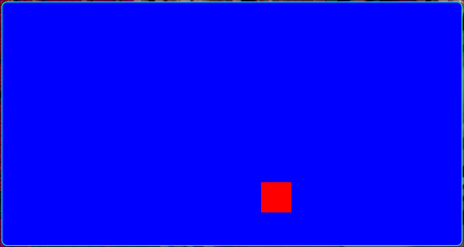

# 🖥️ Ejercicio: Animación "Billiard Square" (Rebote 2D)

**Curso:** Gráficas por Computadora - UAM (Trimestre 26-I)
**Entorno:** Ubuntu 24 | C++ & OpenGL Funciones Fijas


*(Nota: Un cuadrado rojo animado rebotando dentro de los límites de la ventana azul).*

## 📖 Descripción del Código
Este programa ilustra los principios fundamentales de la animación por computadora y la simulación física básica. Un cuadrado rojo se desplaza de manera autónoma por la pantalla, invirtiendo su dirección cada vez que su área de delimitación intersecta con los bordes del volumen de recorte (ventana).

## 🛠️ Técnicas de Graficación Empleadas
* **Game Loop por Timers:** Uso de `glutTimerFunc(33, TimerFunction, 1)` para llamar de forma recursiva a la función de actualización, logrando una tasa de refresco aproximada de 30 FPS.
* **Detección de Colisiones (AABB):** Cálculos aritméticos continuos en el tiempo para evaluar colisiones de cajas alineadas a los ejes (Axis-Aligned Bounding Box) contra un perímetro fijo.
* **Preservación del Aspect Ratio:** Adaptación matemática dinámica de los límites lógicos mediante la lectura del ancho y alto físico de la ventana (`glOrtho()`), previniendo la distorsión del modelo cuadrado. (Abonando al **Objetivo 2: Movimiento y Transformaciones**).

## ⚙️ Compilación y Ejecución
Para compilar en Linux, abre la terminal en el directorio raíz y ejecuta:

```bash
make clean
make run
