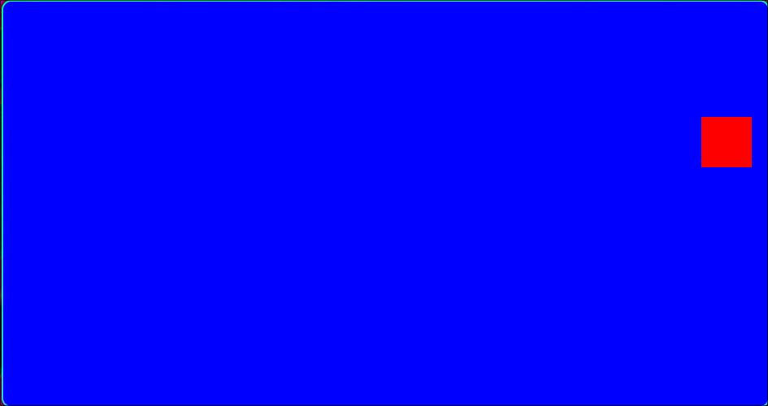

# 🖥️ Ejercicio: Animación "Billiard Square 1" (Optimización de Estado)

**Curso:** Gráficas por Computadora - UAM (Trimestre 26-I)
**Entorno:** Ubuntu 24 | C++ & OpenGL Funciones Fijas


*(Nota: Un cuadrado rojo animado rebotando dentro de los límites de la ventana azul).*

## 📖 Descripción del Código
Este programa es una iteración del ejercicio básico de animación. Su propósito principal es demostrar el funcionamiento de OpenGL como una **Máquina de Estados (State Machine)**, separando las configuraciones estáticas del bucle de renderizado para optimizar el procesamiento.

## 🛠️ Técnicas de Graficación Empleadas
* **Máquina de Estados de OpenGL:** La función `glColor3f()` (que define el color rojo de la figura) fue trasladada de la función recursiva `RenderScene` hacia la función de inicialización `SetupRC`. Como OpenGL mantiene el estado activo hasta que se le indique lo contrario, esta pequeña refactorización ahorra llamadas al API gráfica en cada frame.
* **Game Loop por Timers:** Uso de `glutTimerFunc()` para la actualización asíncrona de las coordenadas a una tasa estable de ~30 FPS.
* **Detección de Colisiones (AABB):** Verificación matemática de los límites del polígono contra los bordes variables del *frustum* ortogonal.

## ⚙️ Compilación y Ejecución
Para compilar en Linux, abre la terminal en el directorio raíz y ejecuta:

```bash
make clean
make run
