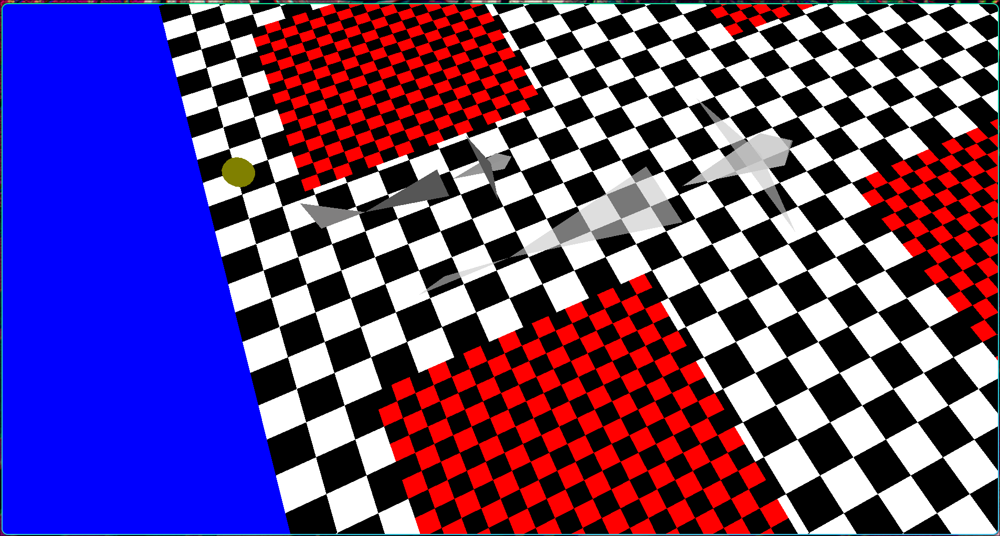

# ✈️ Motor de Vuelo Definitivo (Merge Version)

**Curso:** Gráficas por Computadora - UAM (Trimestre 26-I)
**Entorno:** Linux (Ubuntu 24 / GCC) | C++ & OpenGL Funciones Fijas
**Director de Proyecto:** Gema 1


*(Nota: Modelo jerárquico renderizado con sombras translúcidas calculadas por matrices, sobre un suelo de textura procedural).*

## 📖 Descripción de la Arquitectura
Este programa es una "Fusión" (Merge) que unifica múltiples iteraciones de diseño gráfico de los archivos del servidor Newton. Presenta un Jet 3D completo navegando sobre un plano texturizado con un patrón matemático (tablero de ajedrez). Su mayor fortaleza radica en la unificación de la **Iluminación Dinámica**, el cálculo de **Sombras Translúcidas (Blending)** mediante álgebra de matrices y el sistema de **Selección Interactiva (Picking)**.

---

## 🛠️ Objetivos UAM Cubiertos (Técnicas Empleadas)

Este código consolida gran parte de los requerimientos del proyecto final:

1. **[3] Cámara Controlable:** Implementación de navegación esférica usando `gluLookAt` atado a los eventos del teclado.
2. **[5] Normales / [6] Iluminación / [7] Materiales:** Modelo de reflexión de Phong (`GL_LIGHT0`). El color de los objetos reacciona al vector normal de sus caras, calculado mediante producto cruz (`normcrossprod`).
3. **[8] Sombras Computadas:** Uso de álgebra lineal (`gltMakeShadowMatrix`) para aplastar los vértices 3D del avión contra el plano 2D del suelo, proyectando una silueta exacta respecto a la posición de la luz.
4. **[9] Reflexión y Blending (Translúcidez):** Uso del canal alfa al 60% (`glBlendFunc(GL_SRC_ALPHA, GL_ONE_MINUS_SRC_ALPHA)`) para que la sombra actúe como un filtro oscuro que permite ver la textura del suelo a través de ella.
5. **[10] Controles de Máquina de Estados:** Manipulación en caliente de capacidades gráficas como el *Z-Buffer* (`GL_DEPTH_TEST`), *Culling* (`GL_CULL_FACE`) y Rasterizado de Alambre (`GL_LINE`).
6. **[11] Picking (Interacción):** Implementación de la lente restrictiva `gluPickMatrix` y la Pila de Nombres (`glPushName`). Transforma los clics del ratón 2D en selección de objetos 3D.
7. **[12] Mapeo de Texturas:** Generación procedural de texturas en memoria (`GLubyte`) y su aplicación mapeada (`glTexCoord2f`) mediante interpolación por vecino más cercano (`GL_NEAREST`).

---

## 🎮 Manual de Operación y Controles

### Navegación de la Cámara (El Observador)
* **`Flecha Arriba` / `Flecha Abajo`**: Realiza un *Zoom In* o *Zoom Out* alterando la profundidad.
* **`Flecha Izquierda` / `Flecha Derecha`**: Orbita la cámara horizontalmente alrededor de la escena.
* **`F5` / `F6`**: Orbita la cámara verticalmente (Inclinación sobre el eje Z/Y).

### Control de Iluminación Dinámica (El Sol)
*Al mover la luz (representada por la esfera amarilla), la sombra proyectada recalcula su longitud y ángulo en tiempo real basándose en la matriz de proyección matemática.*
* **`F7` / `F8`**: Acerca o aleja la fuente de luz hacia el centro de la escena.
* **`F9` / `F10`**: Rota la fuente de luz en un arco vertical.
* **`F11` / `F12`**: Mueve y rota la luz a través del plano horizontal.

### Interacción (Sistema de Picking)
* **`Click Izquierdo` (Mouse)**: Sitúa el cursor exactamente sobre la **cola vertical roja** del avión o sobre su **sombra proyectada**. Al dar clic, el código identificará el objeto poligonal tocado en la pila de memoria y le inyectará luz blanca de forma progresiva.

### Depuración del Motor Gráfico (Estados)
* **`F1`**: Alterna el *Culling* (Ignorar caras traseras para ahorrar recursos de renderizado).
* **`F2`**: Alterna el *Depth Test* (Z-Buffer). Al apagarlo, la profundidad matemática se rompe y el orden de renderizado se vuelve caótico.
* **`F3`**: Alterna el modo *Wireframe*. Pasa de polígonos sólidos a su estructura de malla de alambres.
* **`F4`**: Alterna el modelo de sombreado de *Smooth* (Suavizado interpolado) a *Flat* (Sombreado plano por cara).

---

## ⚙️ Compilación y Ejecución
Para compilar este motor en Linux (Ubuntu/Mint), abre la terminal en el directorio raíz del proyecto y ejecuta:

```bash
make clean
make run
